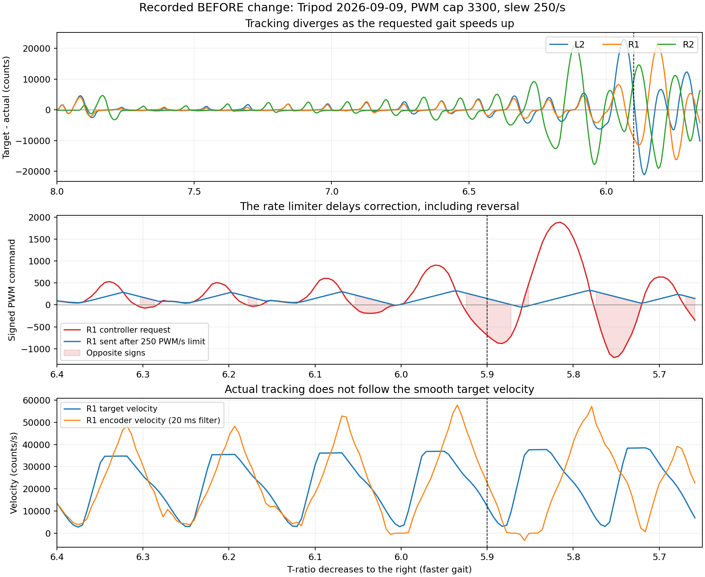

# Tripod 在 T-ratio 約 5.9 失去整齊步態：原版比對與修正

> 後續更新：本文保存 ratio 5.9 異常的診斷與當時版本比較。使用者之後已指定恢復原版控制係數、實際位置基準及 ratio 8→1；最新修改／生效設定見 [Tripod 恢復紀錄](tripod_restore_20260909_zh_TW.md)。

**已證實：目前程式不是 GitHub 原封不動的版本。基本步態軌跡與分組相同，但 PWM 變化率限制會嚴重延遲控制修正。** 這次修正將 Tripod 的額外 PWM slew 改成可選，預設關閉；保留 3300 出力上限與供電／通訊保護。

**已於 21:09:52 部署，現場 revision 13，SHA256 `8067d00b56aa65f04a25582a102b536960c6bdc2106992f4b3016c0896dd5627`。** 現場參數只改 `safety.enable_pwm_slew_limit: true → false`。下次手動啟動 Tripod 生效；文字控制台重新開啟後可使用新開關。

共 **253 項離線檢查通過**：178 項原生 GTest、1 項退役入口檢查、74 項控制台測試；另有 250005 點純軌跡比對與 2228 筆實跑目標重建。已重新連結五個 FSM 執行檔，讓它們共用的設定驗證器接受新旗標；Calibration／Standing 動作原始碼與參數未變，原生回歸通過。Bridge 執行檔／設定雜湊未變。本次沒有啟動／停止真實機器人程序、上電或動作；實機改善仍待下次手動執行確認。

## 比對版本與實跑證據

- GitHub：[`ShuWei-Yang/rinbo_ros_ws`，commit `ddcbce9fecdf039af17784385839eb55baeed2a3`](https://github.com/ShuWei-Yang/rinbo_ros_ws/blob/ddcbce9fecdf039af17784385839eb55baeed2a3/src/rinbo_fsm/src/rinbo_tripod.cpp)，提交日期 2026-06-15，該倉庫目前 main 只有這一個 Initial commit。這能固定比對對象，不能單憑 GitHub 的存在就證明在目前機構上已驗證正常。
- Orin 工作區的 origin 是另一個倉庫 `JasonLiaoJCS/BioRoLaROS2`；不能用本機 HEAD 代表使用者提供的 GitHub 版本。
- 修正前安裝的 Tripod SHA256 為 `e74267257a3aeb054100f616acd57787dc4394e09ba33e208b73bf8132bcb6ac`，與 20:16 的部署紀錄一致。
- 本次實跑日誌：`/tmp/rslip-launcher/20260909-204023-023/rinbo_tripod.log`。資料夾時間是操作階段建立時間；動作初始化在 **20:44:06**，本次在約 **20:45:01** 收到正常停止要求，wrapper 最後記錄退出碼 **0**。沒有這次 Tripod safety stop 的紀錄。
- 日誌記錄現場 revision **12**、SHA256 `bd6ada5ff5f9be724f68fb09545f4ba912f6abcbd302b012d291d0353e4788dd`，增益、PWM、slew 與目前設定一致。該程序已退出，無法事後再讀取它當時的 `/proc/PID/exe` 雜湊。

## GitHub 與修正前實際設定的差異

| 項目 | GitHub 原版 | Orin 修正前 |
|---|---|---|
| 站立段多項式係數 | 六個固定係數 | 相同 |
| 支撐／擺腿段時間 | 0.175887413151118／0.227629442432964 | 相同 |
| 擺腿段梯形速度、br | br=0.3 | 相同 |
| A 組 | R1、L2、R3 | 相同 |
| B 組 | L1、R2、L3，晚半週期 | 相同，但 L3 屏蔽 |
| 編碼器與命令方向 | 左 raw、右 −raw；正 PWM 左 true、右 false | 相同 |
| 每圈 counts | 54984.83 | 相同；仍缺硬體規格／實測佐證 |
| 多圈位置 | 持續累加完整圈數 | 保留，不改成最短角度差 |
| PWM 最大值 | 3300 | 3300 |
| 額外 PWM slew | 無 | **強制開啟 250 PWM/s** |
| kp／kd | **0.38／0.003** | **0.08／0.006**，實際來自現場 YAML |
| k_ff | 0.005 | 相同 |
| 摩擦補償 | 無 | **40 PWM，隨目標速度平滑淡入** |
| 速度回讀供控制使用 | 原始差分 | 加入 **20 ms 濾波**，原始值仍留存 |
| STARTUP | **4 秒三次曲線**，終點帶速度 | **8 秒五次曲線**，終點靜止 |
| home offset | STARTUP 完成及 B 組啟動時，以 actual 重設 | 保留計畫終點，避免吃掉追蹤誤差 |
| 開始步態 | 直接進原軌跡 | 各組加入短暫平滑起步，完成後回到原相位 |
| T-ratio | 8 → **1** | 8 → **4** |
| ratio_step | 每次 callback −0.0002，受回讀頻率影響 | −0.00005 × dt/0.001，即每秒 −0.05 |
| 停止 | ratio 逐次增加至 10 | 最後參考速度在 2 秒內降至零，5 秒逾時界線 |
| 有限位置追蹤誤差 | 無此位置保護 | 現場已設為只警告，不會因此停機 |

GitHub 的建構子雖先寫 `current_ratio_=5`，但 STARTUP 完成時會指定為 `start_ratio_=8`；實際 RUNNING 起始仍是 8。

因此不能說目前「步態指令完全沒動過」。但也不能把所有改動都判定成此次混亂的原因：起步過渡在 RUNNING 初期已完成，觀察到 ratio 5.9 時已運行約 42 秒。

## 直接證據：控制器要修正，送出命令卻被拖住

**20:44:57.01，ratio=5.897957** 的同一筆 `TRIPOD_TRACE`：

| 腿 | 帶符號位置誤差 counts | 控制器要求 PWM | 額外限制後送出 PWM |
|---|---:|---:|---:|
| L1 | +5040 | +613 | +249 |
| L2 | +1924 | **−59** | **+345** |
| R1 | −9474 | **−726** | **+135** |
| R2 | +10527 | +1199 | +124 |
| R3 | −4799 | **−258** | **+51** |
| L3 | 屏蔽 | 0 | 0 |

以上都是 Tripod 正規化座標內的帶符號值。R1 要求負向修正，額外限速後仍送正向，這是實際日誌中的控制路徑差異，不是馬達模型推測。在 ratio 5.8～6.0 的 38 個約 10 Hz 診斷樣本中，L2／R1／R2／R3 每一筆都受到 slew 改寫；該區段各腿所需與送出的值均未碰到 3300 上限。增加最大 PWM 無法解除另一個「每秒只能改 250」的限制。

只計現有 `k_ff=.005` 與擺腿加速段，理想零追蹤誤差下的前饋命令變化率如下：

| ratio | 步態週期（秒） | 前饋命令變化率（PWM/s） |
|---|---:|---:|
| 8 | 3.228 | 221.6 |
| 6 | 2.421 | 393.9 |
| 5.9 | 2.381 | **407.4** |
| 5 | 2.018 | 567.2 |
| 4 | 1.614 | 886.3 |

這是控制公式的需求，不是已辨識的硬體能力。ratio 5.9 時連零誤差的前饋都可能被 250/s 改寫，再加上位置／速度修正，更容易產生落後、超前和延遲反向。

## 排除「ratio 5.9 突然換步態」

從兩版原始碼直接擷取純數學方法，編譯成不含 ROS／硬體介面的比對程式：

- ratio 8、6、5.9、5、4，共 **250005 個正相位比較點**，跨多圈且避開起步混合區。兩版位置差最大約 **3.17×10⁻⁸ counts**，速度差為 **0**。
- 從本次實跑擷取 **2228 筆啟用腿的目標參考**，重算 target／velocity。位置重建差最大 **0.0313 counts**、速度差 **0.00195 counts/s**，符合 float32 與文字輸出精度。
- 同組各腿扣掉各自 home 後，目標差最大 **0.03125 counts**；沒有同組被分派不同相位的證據。
- 支撐轉擺腿、擺腿轉下一圈的接點位置／速度連續；未發現 ratio 5.9 的特殊分支。

可證實的主要問題是額外 slew 與目前控制要求衝突。kp／kd、速度濾波、摩擦補償和 L3 屏蔽也與 GitHub 不同，可能影響實際表現；本次不把它們一起改回，以免多項變更混在一起。沒有電流／電壓同步 bag、機構負載或量測影片，不能宣稱已排除所有硬體因素，也不能從離線結果保證實機步態已完全恢復。

## 修正範圍與操作

- Tripod `safety.enable_pwm_slew_limit` 預設改為 **false**。已夾在 ±3300 內的控制要求直接通過，不再由額外 slew 延遲加速、減速或反向。
- 取消驗證器「必須啟用 slew」與「不能高於 250/s」的要求。若日後主動啟用，可自訂正的有限變化率；無效數值仍拒絕。
- `./robot.sh` → **15 → 3 Tripod → 6 額外限制出力變化速度**：0=不限制，1=限制。第 7 項的數字只在開啟時生效。`p 較寬調機設定` 會使用 3300、位置只警告、額外 slew 關閉；`r 舊版數值` 會恢復舊限制。
- 原生設定入口：`rinbo_legs tune-limits tripod --expect-revision N enable_pwm_slew_limit=0`；N 使用 status 的目前版本。只改設定，不啟動動作。
- 限制關閉後，參考預算訊息不再因未啟用的 250/s 而誤報 slew 警告。
- 另外修正控制台 Calibration 等待值：介面與原生程式允許每階段至 600 秒，外層等待計算原本只接受 60 秒，現在同步為 600。實際校正參數不變。

Tripod 實際使用的原生 Bridge 不經過 sim-to-real 的 `rinbo_ros_backend.py`；該檔案的限制不能解釋這次 Tripod。逐腳動作也有獨立的 250/s 整形，但不在 Tripod 的命令路徑；本次未取得它造成同類問題的證據，維持其既有行為。Calibration／Standing 控制增益、到位設定與動作程式不修改。

保留：3300 上限、有限位置誤差只警告、L3 屏蔽、多圈軌跡、2 秒正常減速停止、急停、過流／電壓／Relay 核對、來源與時效／無效資料檢查。沒有新增自動上電、重啟或實機測試。

## 程式與證據位置

- `src/rinbo_fsm/src/rinbo_tripod.cpp`：slew 預設／預算診斷／`apply_pwm_slew_limit()`。
- `src/rinbo_fsm/src/safety_invariants.hpp`：Tripod 可選 slew 的數值驗證。
- `src/rinbo_fsm/src/robot_config.cpp`：預設值與 `tune_limits()` 設定入口。
- `src/rinbo_control/rinbo_control/motion_limits.py`：選單 15／3 的新開關與變化率欄位。
- `tools/analyze_tripod_gait_compare.py`：編譯兩版擷取的純數學方法、重算實跑目標。
- `tools/plot_tripod_gait_compare.py`：只讀日誌的比較圖。
- [完整診斷資料](diagnostics/tripod_gait_compare_20260909/)：固定版本、修正前 source／設定／日誌快照、差異、數值結果與測試紀錄。`current-*` 是本次關閉限制前的封存快照。

Windows 若沒有強制要求 Tripod `safety.enable_pwm_slew_limit=true`，日常按鈕不需改。如果有此固定檢查，應同步接受本次設定 false；不能再次覆寫回 true。Bridge 的 `motor_command_max_pwm=3300.0` 預期值仍依前份 Windows 交接同步。
